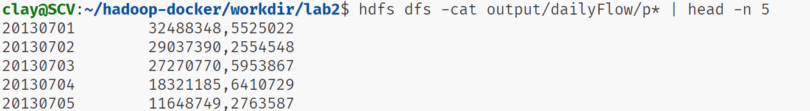
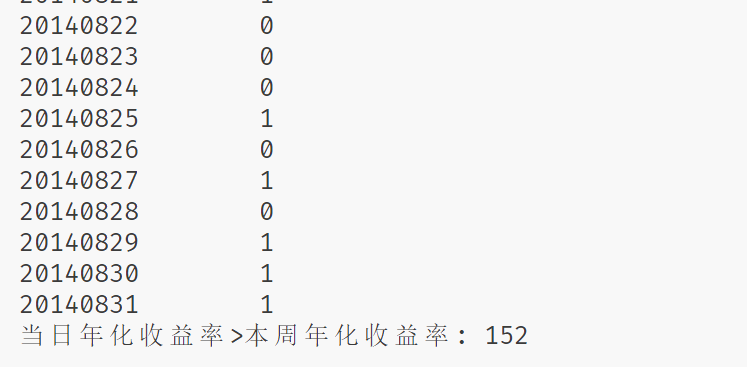

```bash
.
├── README.md
├── assets
│   ├── >for readme
├── input
│   ├── mfd_bank_shibor.csv
│   ├── mfd_day_share_interest.csv
│   ├── user_balance_table.csv
│   └── user_profile_table.csv
├── output
│   ├── lab2-1.0-SNAPSHOT.jar
│   └── output
│       ├── dailyFlow
│       ├── transactionInfluence
│       ├── userActivity
│       └── weeklyFlow
├── pom.xml
├── run.sh
├── src
│   ├── main
│   │   ├── java
│   │   └── resources
│   └── test
│       └── java
└── target
    ├── >build dir

```  


# 任务1：

​​

**一、设计思路**

1. **Mapper 阶段**：

    * 输入：以行号（`LongWritable`​）和文本行（`Text`​）作为输入，每一行代表一条交易数据。
    * 处理：将输入的文本行按照逗号分割成字段数组。提取交易日期（`date`​）、资金流入（`purchaseAmt`​）和资金流出（`redeemAmt`​）。如果资金流入或流出字段为空，则设置为 0。最后，以交易日期作为键（`Text`​），资金流入和流出用逗号连接作为值（`Text`​）输出。
2. **Reducer 阶段**：

    * 输入：键为交易日期（`Text`​），值为一组资金流入和流出的字符串（`Iterable<Text>`​）。
    * 处理：遍历所有的值，将资金流入和流出分别累加。如果在转换为长整型时出现异常，则跳过该值并打印错误信息。最后，以交易日期作为键，总资金流入和总资金流出用逗号连接作为值输出。
3. **主函数**：

    * 设置 Hadoop 作业的配置信息，指定作业名称、输入输出路径、Mapper 和 Reducer 类等。最后等待作业完成并根据结果退出程序。

**二、运行结果**

给定一个包含交易数据的文件作为输入，程序会统计每天的资金流入和流出总额，并将结果输出到指定的文件中。输出文件的每一行格式为 “交易日期，总资金流入，总资金流出”。

**三、可能的改进之处**

1. **错误处理**：目前在处理非数字值时只是简单地跳过并打印错误信息。可以考虑更详细的错误记录，或者在输入数据前进行数据清洗，以确保数据的质量。
2. **性能优化**：如果数据量非常大，可以考虑对 Mapper 和 Reducer 的数量进行调整，以提高作业的并行度。另外，可以对数据进行压缩，减少网络传输和存储开销。
3. **扩展性**：如果后续需要统计更多的指标，可以方便地在 Reducer 中进行扩展，而不需要对 Mapper 进行大的改动。

# 任务2：

​​

**一、设计思路**

1. **Mapper 阶段**：

    * 输入：以任意类型的键（`Object`​）和文本行（`Text`​）作为输入，每一行代表一条包含日期和资金流入流出数据的记录，数据以制表符分隔。
    * 处理：将输入的文本行按照制表符分割成字段数组。提取日期字符串和资金流入流出字符串，然后使用`SimpleDateFormat`​将日期字符串解析为`Date`​对象，再根据该对象获取对应的星期几的字符串。最后，以星期几作为键（`Text`​），资金流入和流出用逗号连接作为值（`Text`​）输出。
2. **Reducer 阶段**：

    * 输入：键为星期几（`Text`​），值为一组资金流入和流出的字符串（`Iterable<Text>`​）。
    * 处理：遍历所有的值，将资金流入和流出分别累加，并记录数据条数。然后计算平均资金流入和平均资金流出。最后，以星期几作为键，平均资金流入和平均资金流出用逗号连接作为值输出。
3. **主函数**：

    * 设置 Hadoop 作业的配置信息，指定作业名称、输入输出路径、Mapper 和 Reducer 类等。最后等待作业完成并根据结果退出程序。

**二、运行结果**

给定一个包含日期和资金流入流出数据的文件作为输入，程序会统计每个星期几的平均资金流入和平均资金流出，并将结果输出到指定的文件中。输出文件的每一行格式为 “星期几，平均资金流入，平均资金流出”。

**三、可能的改进之处**

1. **错误处理**：在`map`​方法中捕获`ParseException`​异常后只是打印堆栈信息，可以考虑更友好的错误处理方式，比如记录错误日志或者跳过错误数据并继续处理其他数据。
2. **性能优化**：如果数据量非常大，可以考虑对 Mapper 和 Reducer 的数量进行调整，以提高作业的并行度。另外，可以对数据进行压缩，减少网络传输和存储开销。

# 任务3：

​​

**一、设计思路**

1. **Mapper 阶段**：

    * 输入：以任意类型的键（`Object`​）和文本行（`Text`​）作为输入，每一行代表一条用户活动数据记录，数据以逗号分隔。
    * 处理：将输入的文本行按照逗号分割成字段数组。提取用户 ID（`userId`​）以及直接购买金额（`directPurchase`​）和总赎回金额（`totalRedeem`​），在转换为长整型时捕获异常并打印堆栈信息。如果直接购买金额或总赎回金额大于 0，则以用户 ID 作为键（`Text`​），整数 1 作为值（`IntWritable`​）输出，表示该用户在这一天有活动。
2. **Reducer 阶段**：

    * 输入：键为用户 ID（`Text`​），值为一组整数 1 的集合（`Iterable<IntWritable>`​），表示该用户有活动的天数。
    * 处理：遍历所有的值，将整数 1 累加，得到该用户的活跃天数。最后，以用户 ID 作为键，活跃天数作为值（`IntWritable`​）输出。
3. **主函数**：

    * 设置 Hadoop 作业的配置信息，指定作业名称、输入输出路径、Mapper 和 Reducer 类等。最后等待作业完成并根据结果退出程序。

**二、运行结果**

给定一个包含用户活动数据的文件作为输入，程序会统计每个用户的活跃天数，并将结果输出到指定的文件中。输出文件的每一行格式为 “用户 ID，活跃天数”。

**三、可能的改进之处**

1. **错误处理**：在`map`​方法中捕获异常后只是打印堆栈信息，可以考虑更详细的错误处理方式，比如记录错误日志或者将错误数据单独输出到一个文件中进行后续分析。
2. **性能优化**：如果数据量非常大，可以考虑对 Mapper 和 Reducer 的数量进行调整，以提高作业的并行度。另外，可以对数据进行压缩，减少网络传输和存储开销。

# 任务4：

**map阶段：**

1. 将每一行数据转换为字符串，并使用逗号分隔成3个字段：`mfdDate`​（日期）、`mfdDailyYield`​（日收益率）和 `mfdWeeklyYield`​（周收益率）。
2. 忽略表头，跳过以 `"mfd_date"`​ 开头的行。
3. 根据公式 `lambda = 100 * (Math.pow((mfdDailyYield / 10000 + 1), 365) - 1)`​ ，以本日万元收益计算 `lambda`​（年化收益率）。
4. 将每日年化收益率 `lambda`​ 和周平均年化收益率 `mfdWeeklyYield`​ 进行比较，如果 `lambda`​ 大于 `mfdWeeklyYield`​，输出 `1`​；否则，输出 `0`​，使用日期 `mfdDate`​ 作为 `key`​。

**reduce阶段：**

1. ​`reduce`​ 方法接收 `Mapper`​ 传递的日期和 1 或 0，并将这些值直接输出到 `Context`​ 中。
2. 同时，它累积所有传递的值，统计 `globalOneCount`​，用于记录全局范围内 `lambda > mfdWeeklyYield`​ 的次数。
3. ​`cleanup`​ 方法在 `Reducer`​ 任务完成后执行，输出全局统计结果，即 `globalOneCount`​ 的值，表示年化收益率小于周收益率的总天数。

### 结论：

有不到一半的时间里，单日年化收益高于周平均年化收益。这启发我们要减少非必要的调仓操作，长期持有的收益概率高于追涨杀跌。

‍

​​

‍
